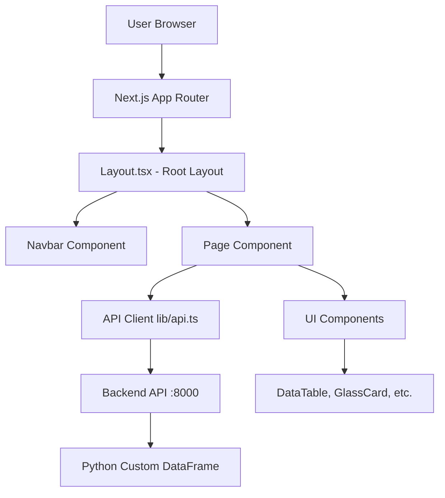

# OlympiaScope Frontend Documentation

## Table of Contents
1. [Overview](#overview)
2. [Technology Stack](#technology-stack)
3. [Project Structure](#project-structure)
4. [Architecture](#architecture)
5. [Components](#components)
6. [Pages & Routes](#pages--routes)
7. [API Integration](#api-integration)
8. [Type System](#type-system)
9. [Styling & Design](#styling--design)
10. [Performance Optimizations](#performance-optimizations)
11. [Getting Started](#getting-started)

---

## Overview

OlympiaScope is a modern web application built to visualize and analyze Olympic Games data. The frontend provides an intuitive interface for exploring athlete performances, medal standings, and statistical analytics across different Olympic years.

### Key Features
- 🏅 **Medal Standings**: Country-wise medal leaderboards with year filtering
- 🔍 **Athlete Search**: Advanced search with multiple filters (name, season, year, sport, country)
- 📊 **Analytics Dashboard**: Medal efficiency metrics (medals per capita, medals per GDP)
- 📋 **Data Preview**: Raw dataset exploration with pagination
- 🎨 **Modern UI**: Glass morphism design with Olympic theming
- ⚡ **Performance**: Optimized rendering with minimal animations

---

## Technology Stack

### Core Framework
- **Next.js 16.0.3**: React framework with app router, server components, and Turbopack
- **React 19.2.0**: Latest React with concurrent features
- **TypeScript 5**: Type-safe development

### Styling
- **Tailwind CSS 4**: Utility-first CSS framework
- **Framer Motion 12**: Animation library (limited usage for performance)
- **Custom CSS**: Glass morphism effects and Olympic color themes

### UI Components
- **Lucide React**: Icon library for modern, consistent icons
- **clsx**: Conditional CSS class names
- **tailwind-merge**: Merge Tailwind classes intelligently

### Development Tools
- **ESLint**: Code linting with Next.js config
- **PostCSS**: CSS processing
- **TypeScript**: Full type safety

---

## Project Structure

```
frontend/
├── public/                  # Static assets
│   ├── hero-bg.png         # Landing page background
│   └── *.svg               # Icons
├── src/
│   ├── app/                # Next.js app router pages
│   │   ├── layout.tsx      # Root layout with navbar
│   │   ├── page.tsx        # Home page (data preview)
│   │   ├── globals.css     # Global styles and themes
│   │   ├── athlete-search/ # Athlete search page
│   │   ├── medal-table/    # Medal standings page
│   │   ├── analytics/      # Analytics page
│   │   └── join-demo/      # Join operation demo
│   ├── components/
│   │   ├── Navbar.tsx              # Main navigation
│   │   ├── BackendOperations.tsx  # Info panel
│   │   └── ui/                     # Reusable UI components
│   │       ├── DataTable.tsx       # Generic data table
│   │       ├── GlassCard.tsx       # Glass morphism container
│   │       ├── Hero.tsx            # Landing hero section
│   │       ├── OlympicRings.tsx    # Olympic rings background
│   │       └── Pagination.tsx      # Pagination controls
│   └── lib/
│       ├── api.ts          # Backend API client functions
│       ├── types.ts        # TypeScript type definitions
│       └── utils.ts        # Utility functions (cn helper)
├── package.json
├── tsconfig.json
├── tailwind.config.ts
└── next.config.ts
```

---

## Architecture

### Application Flow



### Component Hierarchy

```
RootLayout
├── Navbar (fixed, always visible)
└── Main Content Area
    └── Page Components
        ├── Home (Data Preview)
        ├── Athlete Search
        ├── Medal Standings
        ├── Analytics
        └── Join Demo
```

### Data Flow Pattern

1. **User Interaction** → Trigger event (button click, input change)
2. **State Update** → React state updates (useState)
3. **Effect Trigger** → useEffect watches state changes
4. **API Call** → Fetch data from backend via `lib/api.ts`
5. **State Update** → Set data/loading/error states
6. **Component Re-render** → Display updated data

---

## Components

### Layout Components

#### `layout.tsx` - Root Layout
**Location**: `src/app/layout.tsx`

```typescript
export default function RootLayout({
  children,
}: {
  children: React.ReactNode;
})
```

**Purpose**: Provides the root HTML structure for the entire application.

**Features**:
- Sets up Inter font from Google Fonts
- Includes global `Navbar` component
- Configures page metadata (title, description)
- Applies global CSS classes for layout and overflow handling
- Creates scrollable main content area with padding

**Styling**:
- Fixed navbar at top
- Full-screen flex layout
- Black background gradient
- Padding: top (pt-24), horizontal (px-8), bottom (pb-8)

---

### Navigation Components

#### `Navbar.tsx` - Main Navigation Bar
**Location**: `src/components/Navbar.tsx`

**Purpose**: Primary navigation component with glass morphism design.

**Features**:
- Fixed position at top of viewport
- Responsive design (hidden menu on mobile)
- Active route highlighting with animation
- Smooth transitions between pages

**Navigation Items**:
1. **Home** (/)
2. **Athlete Search** (/athlete-search)
3. **Medal Standings** (/medal-table)
4. **Analytics** (/analytics)

**Animation**:
- Uses `framer-motion` for:
  - Rotating border animation on logo
  - Animated active state indicator that follows the selected tab

**Styling**:
- Glass morphism background
- Rounded pill shape
- Olympic color accents (gold highlight)
- Hover effects on navigation items

**Code Highlight**:
```typescript
const navItems = [
    { name: "Home", path: "/" },
    { name: "Athlete Search", path: "/athlete-search" },
    { name: "Medal Standings", path: "/medal-table" },
    { name: "Analytics", path: "/analytics" },
];
```

---

### UI Components

#### `DataTable.tsx` - Generic Data Table
**Location**: `src/components/ui/DataTable.tsx`

**Purpose**: Reusable component for displaying tabular data with consistent styling.

**Props**:
```typescript
interface DataTableProps<T> {
    data: T[];              // Array of data rows
    columns?: (keyof T)[];  // Optional column specification
    className?: string;     // Additional CSS classes
}
```

**Features**:
- **Generic Type Support**: Works with any data shape
- **Auto Column Detection**: Infers columns from data if not specified
- **Null Handling**: Displays "NA" for null values in italic gray
- **Responsive**: Horizontal scroll on overflow
- **Animations**: Staggered fade-in for rows (framer-motion)

**Styling**:
- Glass morphism container
- Gold headers with uppercase text
- Hover effects on rows
- Alternating row dividers

**Example Usage**:
```typescript
<DataTable 
  data={athletes} 
  columns={["Name", "Country", "Medal", "Year"]} 
/>
```

---

#### `GlassCard.tsx` - Container Component
**Location**: `src/components/ui/GlassCard.tsx`

**Purpose**: Reusable glass morphism card container.

**Props**:
```typescript
interface GlassCardProps {
    children: React.ReactNode;
    className?: string;
    hoverEffect?: boolean;  // Default: true
}
```

**Features**:
- Glass morphism background effect (blur + transparency)
- Optional hover effects
- Consistent padding and border radius
- Merges custom classes with Tailwind

**Styling Classes**:
- `.glass`: Background blur, transparency, subtle border
- `.glass-hover`: Enhanced background on hover
- Rounded corners (rounded-2xl)
- Shadow effects

**Performance Note**: Animation removed for faster rendering.

---

#### `Hero.tsx` - Landing Page Hero
**Location**: `src/components/ui/Hero.tsx`

**Purpose**: Eye-catching hero section for the landing page.

**Features**:
- **Background Image**: Olympic stadium (hero-bg.png) with gradient overlay
- **Olympic Rings**: Animated Olympic rings behind the title
- **Title Animation**: Fade-in and scale effect
- **Olympic Colors**: Color bars representing the five Olympic rings
- **Responsive**: Adjusts text size on mobile vs desktop

**Sections**:
1. **Background Layer**: Image + dark gradient
2. **Olympic Rings**: 5 interlocking rings with increased visibility (opacity: 0.25)
3. **Main Title**: "OLYMPIA**SCOPE**" with gold gradient on "SCOPE"
4. **Tagline**: "Unveiling the Data Behind the Glory"
5. **Color Bars**: Five horizontal bars in Olympic colors

**Code Highlight**:
```typescript
// Olympic Rings positioning
<div className="relative w-full h-full">
    <div className="w-40 h-40 border-[12px] border-olympic-blue" />
    <div className="w-40 h-40 border-[12px] border-olympic-yellow" />
    <div className="w-40 h-40 border-[12px] border-white" />
    <div className="w-40 h-40 border-[12px] border-olympic-green" />
    <div className="w-40 h-40 border-[12px] border-olympic-red" />
</div>
```

---

#### `OlympicRings.tsx` - Background Rings
**Location**: `src/components/ui/OlympicRings.tsx`

**Purpose**: Displays Olympic rings as a subtle background element on all pages.

**Features**:
- **Performance Optimized**: No animations (removed for speed)
- **Proper Opacity**: 20% opacity for visibility without distraction
- **Proper Z-Index**: zIndex: 0 to appear behind content
- **Centered**: Uses translate-x-1/2 for perfect centering
- **Pointer Events**: Disabled to prevent interaction

**Styling**:
```typescript
className="absolute top-32 left-1/2 -translate-x-1/2 
           w-[500px] h-[250px] pointer-events-none opacity-20"
style={{ zIndex: 0 }}
```

**Olympic Ring Colors**:
- Blue: `#0081C8`
- Yellow: `#FCB131`
- White: (for dark background)
- Green: `#00A651`
- Red: `#EE334E`

---

#### `Pagination.tsx` - Pagination Controls
**Location**: `src/components/ui/Pagination.tsx`

**Purpose**: Standard pagination component for navigating large datasets.

**Props**:
```typescript
interface PaginationProps {
    currentPage: number;
    totalPages: number;
    onPageChange: (page: number) => void;
}
```

**Features**:
- Previous/Next buttons with chevron icons
- Disabled state for first/last page
- Current page indicator
- Accessible button states

**Example Usage**:
```typescript
<Pagination
    currentPage={page}
    totalPages={Math.ceil(total / 50)}
    onPageChange={setPage}
/>
```

---

#### `BackendOperations.tsx` - Info Panel
**Location**: `src/components/BackendOperations.tsx`

**Purpose**: Displays backend operation details in a toggleable panel.

**Props**:
```typescript
interface BackendOperationsProps {
    items: {
        title: string;
        description: string;
        code?: string;
    }[];
}
```

**Features**:
- **Fixed Bottom-Right**: Always accessible via floating button
- **Toggle State**: Expandable panel
- **Code Snippets**: Inline code formatting
- **Educational**: Shows backend implementation details

**UI States**:
1. **Collapsed**: Info icon button in bottom-right corner
2. **Expanded**: Panel showing operation details

**Styling**:
- Dark mode compatible
- Border and shadow effects
- Scrollable content area
- Monospace code formatting

---

## Pages & Routes

### 1. Home Page - Data Preview
**Route**: `/`  
**File**: `src/app/page.tsx`

**Purpose**: Landing page with data preview functionality.

**Features**:
- **Hero Section**: Large title with Olympic rings
- **Collapsible Preview**: Toggle to show/hide data tables
- **Row Count Control**: Input to adjust preview size (1-100)
- **Dual Tables**: Events and Countries data side-by-side
- **Nested Collapsibles**: Each table can be expanded/collapsed independently

**State Management**:
```typescript
const [previewOpen, setPreviewOpen] = useState(true);
const [eventsOpen, setEventsOpen] = useState(false);
const [countriesOpen, setCountriesOpen] = useState(false);
const [rowCount, setRowCount] = useState(10);
const [events, setEvents] = useState<EventRow[]>([]);
const [countries, setCountries] = useState<CountryRow[]>([]);
const [loading, setLoading] = useState(false);
const [error, setError] = useState<string | null>(null);
```

**API Calls**:
- `fetchEventsPreview(rowCount)`: Get events data
- `fetchCountriesPreview(rowCount)`: Get countries data

**Performance**:
- Debounced data loading (500ms delay on row count change)
- Parallel API calls with `Promise.all()`

---

### 2. Athlete Search Page
**Route**: `/athlete-search`  
**File**: `src/app/athlete-search/page.tsx`

**Purpose**: Advanced search interface for finding athletes and their Olympic results.

**Search Filters**:
1. **Name**: Text search (supports partial matches)
2. **Season**: Summer / Winter / All
3. **Year Range**: Slider from 1896 to 2016
4. **Country (NOC)**: Dropdown with all countries
5. **Sport**: Dropdown with all sports
6. **Medal Filter**: Checkbox to show only medal winners

**Features**:
- **Pagination**: 50 results per page
- **Auto-search on page change**: Automatically fetches next page
- **Dynamic Dropdowns**: NOC and Sport options loaded on mount
- **Keyboard Support**: Press Enter in name field to search

**State Management**:
```typescript
const [name, setName] = useState("");
const [season, setSeason] = useState("All");
const [yearMin, setYearMin] = useState(1896);
const [yearMax, setYearMax] = useState(2016);
const [noc, setNoc] = useState("All");
const [sport, setSport] = useState("All");
const [medalOnly, setMedalOnly] = useState(true);
const [page, setPage] = useState(1);
const [results, setResults] = useState<EventRow[]>([]);
const [total, setTotal] = useState(0);
```

**API Integration**:
```typescript
const res = await searchAthletes({
    name, season, year_min, year_max, noc, sport,
    medal_only: medalOnly, page, page_size: 50
});
```

**Displayed Columns**:
Name, Sex, Age, Team, NOC, Year, Season, City, Sport, Event, Medal

---

### 3. Medal Standings Page
**Route**: `/medal-table`  
**File**: `src/app/medal-table/page.tsx`

**Purpose**: Country medal leaderboard with year filtering.

**Features**:
- **Year Filter**: Dropdown from 1896-2016 or "All years"
- **Top N Control**: Slider to show 5-50 countries
- **Dynamic Updates**: Auto-refresh on filter changes
- **Medal Counts**: Shows total medals by country

**Filters**:
```typescript
const [year, setYear] = useState<string | number>("All years");
const [topN, setTopN] = useState(20);
```

**API Call**:
```typescript
await fetchLeaderboard(year, topN);
```

**Displayed Columns**:
- NOC (Country Code)
- region (Country Name)
- Year
- count_Medal / medal_count (Total Medals)

**UI Components**:
- GlassCard for filter controls
- DataTable for results
- BackendOperations panel showing:
  - Streaming aggregation
  - CSV parsing
  - Join operations

---

### 4. Analytics Page
**Route**: `/analytics`  
**File**: `src/app/analytics/page.tsx`

**Purpose**: Medal efficiency analysis comparing countries.

**Metrics**:
- **Medals per Million People**: Population efficiency
- **Medals per Billion GDP**: Economic efficiency
- **Total Medals**: Absolute count

**Filters**:
1. **Year**: Slider from 1960-2016
2. **Season**: Summer / Winter / All
3. **Medal Type**: Gold / Silver / Bronze / All
4. **Sort By**: Choose efficiency metric
5. **Top N**: Show top 5-50 countries

**State**:
```typescript
const [year, setYear] = useState(2012);
const [season, setSeason] = useState("All");
const [medal, setMedal] = useState("All");
const [sortBy, setSortBy] = useState("Medals per million people");
const [topN, setTopN] = useState(20);
```

**API Call**:
```typescript
await fetchEfficiency({ year, season, medal, sort_by, top_n });
```

**Displayed Columns**:
NOC, region, Country Name, Year, medal_count, Population, GDP_USD, medals_per_million, medals_per_billion_gdp

---

### 5. Join Demo Page
**Route**: `/join-demo`  
**File**: `src/app/join-demo/page.tsx`

**Purpose**: Demonstrates join operation between events and countries data.

**Features**:
- Shows 100 rows of joined data
- Displays event information with region names
- Educational component showing backend join implementation

**API Call**:
```typescript
await fetchJoinDemo(100);
```

**Displayed Columns**:
Name, Year, Season, Sport, Event, Medal, NOC, region

---

## API Integration

### Backend Connection
**Base URL**: `http://localhost:8000/api`

All API functions are centralized in `src/lib/api.ts`.

### API Functions

#### 1. `fetchEventsPreview(limit)`
**Endpoint**: `GET /api/preview/events?limit={limit}`  
**Returns**: `EventRow[]`  
**Purpose**: Fetch preview of events data

#### 2. `fetchCountriesPreview(limit)`
**Endpoint**: `GET /api/preview/countries?limit={limit}`  
**Returns**: `CountryRow[]`  
**Purpose**: Fetch preview of countries data

#### 3. `searchAthletes(params)`
**Endpoint**: `GET /api/athletes/search?{params}`  
**Returns**: `{ data: EventRow[], total: number }`  
**Purpose**: Search athletes with filters

**Parameters**:
```typescript
{
    name?: string;
    season?: string;
    year_min?: number;
    year_max?: number;
    noc?: string;
    sport?: string;
    medal_only?: boolean;
    page?: number;
    page_size?: number;
}
```

#### 4. `fetchSports()`
**Endpoint**: `GET /api/sports`  
**Returns**: `string[]`  
**Purpose**: Get list of all sports

#### 5. `fetchLeaderboard(year, top_n)`
**Endpoint**: `GET /api/leaderboard?year={year}&top_n={top_n}`  
**Returns**: `LeaderboardRow[]`  
**Purpose**: Get country medal rankings

#### 6. `fetchEfficiency(params)`
**Endpoint**: `GET /api/efficiency?{params}`  
**Returns**: `EfficiencyRow[]`  
**Purpose**: Get medal efficiency metrics

#### 7. `fetchJoinDemo(limit)`
**Endpoint**: `GET /api/join-demo?limit={limit}`  
**Returns**: `JoinDemoRow[]`  
**Purpose**: Get joined data for demonstration

### Error Handling
All API functions throw errors on failed requests:
```typescript
if (!res.ok) throw new Error("Failed to fetch ...");
```

Pages handle errors with try-catch and display error messages to users.

---

## Type System

### Location
All TypeScript types are defined in `src/lib/types.ts`.

### Type Definitions

#### `EventRow`
Represents a single Olympic event record.
```typescript
interface EventRow {
    ID: string;
    Name: string;
    Sex: string;
    Age: string;
    Height: string;
    Weight: string;
    Team: string;
    NOC: string;           // National Olympic Committee code
    Games: string;
    Year: string | number;
    Season: string;
    City: string;
    Sport: string;
    Event: string;
    Medal: string | null;  // Gold/Silver/Bronze or null
}
```

#### `CountryRow`
Represents country/region information.
```typescript
interface CountryRow {
    NOC: string;
    region: string;
    notes?: string;
}
```

#### `LeaderboardRow`
Represents medal count by country.
```typescript
interface LeaderboardRow {
    NOC: string;
    region: string;
    count_Medal?: number;
    medal_count?: number;
    Year?: number;
}
```

#### `EfficiencyRow`
Represents efficiency metrics.
```typescript
interface EfficiencyRow {
    NOC: string;
    region: string;
    "Country Name": string;
    Year: number;
    medal_count: number;
    Population: number;
    GDP_USD: number;
    medals_per_million: number;
    medals_per_billion_gdp: number;
}
```

#### `JoinDemoRow`
Extends EventRow with region.
```typescript
interface JoinDemoRow extends EventRow {
    region: string;
}
```

---

## Styling & Design

### Design System

#### Color Palette

**Olympic Colors** (defined in `globals.css`):
```css
--color-olympic-blue: #0081C8;
--color-olympic-yellow: #FCB131;
--color-olympic-black: #000000;
--color-olympic-green: #00A651;
--color-olympic-red: #EE334E;
```

**Medal Colors**:
```css
--color-gold: #FFD700;
--color-silver: #C0C0C0;
--color-bronze: #CD7F32;
```

**Background**:
```css
--color-dark-bg: #050505;
background: linear-gradient(to bottom, #000000, #1a1a1a);
```

#### Glass Morphism
Core design pattern throughout the app.

```css
.glass {
    background: rgba(30, 30, 30, 0.7);
    backdrop-filter: blur(20px);
    border: 1px solid rgba(255, 255, 255, 0.1);
    box-shadow: 0 8px 32px 0 rgba(0, 0, 0, 0.37);
}

.glass-hover:hover {
    background: rgba(40, 40, 40, 0.8);
    border-color: rgba(255, 255, 255, 0.2);
}
```

#### Text Gradient
Used for emphasis on titles.
```css
.text-gradient-gold {
    background: linear-gradient(to right, #FFD700, #FDB931, #FFD700);
    -webkit-background-clip: text;
    background-clip: text;
    color: transparent;
    background-size: 200% auto;
    animation: shine 3s linear infinite;
}
```

### Custom Scrollbar
```css
::-webkit-scrollbar {
    width: 8px;
    height: 8px;
}

::-webkit-scrollbar-thumb {
    background: rgba(255, 255, 255, 0.3);
    border-radius: 4px;
}
```

### Responsive Design
- Mobile-first approach with Tailwind breakpoints
- `md:` prefix for tablets and up
- `lg:` prefix for desktops
- Navbar collapses on mobile (currently hidden, not hamburger menu)

---

## Performance Optimizations

### 1. Animation Reduction
**Problem**: Initial animations slowed page load.  
**Solution**: Removed `framer-motion` from:
- `GlassCard.tsx` - Now uses regular `<div>`
- `OlympicRings.tsx` - Static rendering

**Impact**: Faster time-to-interactive, instant filter visibility.

### 2. Debounced Data Loading
**Problem**: Rapid filter changes caused too many API calls.  
**Solution**: 500ms debounce on row count input in home page.

```typescript
const timeoutId = setTimeout(() => {
    loadData();
}, 500);
return () => clearTimeout(timeoutId);
```

### 3. Parallel API Calls
**Problem**: Sequential loading slowed preview page.  
**Solution**: Use `Promise.all()` for concurrent requests.

```typescript
const [eventsData, countriesData] = await Promise.all([
    fetchEventsPreview(rowCount),
    fetchCountriesPreview(rowCount),
]);
```

### 4. Conditional Rendering
- Loading states with spinners
- Error boundaries for failed requests
- Lazy loading of data tables

### 5. Optimized Re-renders
- Proper dependency arrays in `useEffect`
- State updates only when necessary
- Memoization candidates (if needed in future)

---

## Getting Started

### Prerequisites
- Node.js 20+ recommended
- npm or yarn package manager
- Backend server running on `http://localhost:8000`

### Installation

1. **Install dependencies**:
```bash
cd frontend
npm install
```

2. **Environment Variables** (if needed):
Create `.env.local`:
```bash
NEXT_PUBLIC_API_URL=http://localhost:8000/api
```

3. **Start development server**:
```bash
npm run dev
```

Access at: `http://localhost:3000`

### Available Scripts

```bash
npm run dev      # Start development server (Turbopack)
npm run build    # Build production bundle
npm run start    # Start production server
npm run lint     # Run ESLint
```

### Build & Deployment

```bash
# Production build
npm run build

# Start production server
npm run start
```

**Output**: `.next` directory with optimized production build.

---

## Additional Notes

### Browser Compatibility
- Modern browsers (Chrome, Firefox, Safari, Edge)
- ES2020+ features required
- CSS Grid and Flexbox support needed

### Accessibility
- Semantic HTML elements
- Proper heading hierarchy
- Keyboard navigation support
- ARIA labels on interactive elements

### Future Improvements
1. **Mobile Menu**: Add hamburger menu for navbar
2. **Dark/Light Mode Toggle**: Currently dark-only
3. **Advanced Filters**: More granular search options
4. **Data Visualization**: Charts and graphs
5. **Export Functionality**: CSV/JSON download
6. **User Preferences**: Save filter settings
7. **Caching**: Client-side data caching with SWR or React Query
8. **Internationalization**: Multi-language support

---

## Common Issues & Solutions

### Issue: Page loads slowly
**Solution**: Animations have been removed; ensure backend is running and responsive.

### Issue: Olympic rings not visible
**Solution**: Updated opacity to 20% and z-index to 0. Verify `OlympicRings` component is imported.

### Issue: Filters not appearing
**Solution**: Check that backend endpoints are returning data for NOC and Sport lists.

### Issue: API errors (CORS)
**Solution**: Ensure backend has CORS enabled for `http://localhost:3000`.

---

## Contact & Support

For questions or issues with the frontend:
1. Check browser console for errors
2. Verify backend API is running
3. Review network tab for failed requests
4. Check this documentation for component usage

---

**Last Updated**: 2025-11-20  
**Version**: 0.1.0  
**Framework**: Next.js 16.0.3
